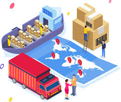

## Sesión 10.
### 21 de noviembre de 2025
No ha venido el profesor.

## Sesión 9.
### 14 de novimebre de 2025
Nosotros fabricamos herramientas que nos permiten viver de una manera más comoda/mejor, todas estas herramientas que fabricamos tiene un proceso. También hemos hablado de las fases de producción de un producto y el peso oculto. Por ejemplo: para fabricar un producto sencillo/ligero, previamente se han utilizado elementos con mayor peso para llegar a producir ese elemento. 

¿Cual es la contaminación de la distribución de un ordenador a las diferentes tiendas? Compara las diferentes formas de distribución con el tráfico de una gran ciudad. 
La contaminación asociada a la distribución de un ordenador a distintas tiendas forma parte de su huella de carbono total y proviene principalmente del transporte y la logística. No existe un valor único universal, porque depende de muchos factores, pero sí se pueden explicar los elementos que componen esa contaminación.

En este caso, voy a hablar de el transporte internacional de un ordenador hacia diferentes tiendas de diferentes paises.

Contaminación avión de mercancias: alrededor de 500-600g de CO2 por tonelada-Km
Contaminación barco de mercancias: alrededor de 10-40g de CO2 por tonelada-Km
Contaminación tren de mercancias: alrededor de 20-60g de CO2 por tonelada-Km

Contaminación de los coches en una gran ciudad: alrededor de 120-180g de CO2 por Km
Supongamos que en una gran ciudad circulan 1 millón de coches al dia y que cada coche circula una media de 20km, obtendriamos una media de 3000 toneladas de CO2 al día.

Conclusión: El transporte más contaminante por km es el avión, que supera claramente a la contaminación del tráfico de una gran ciudad. Y el tranporte menos contaminante por km es el barco, contaminando mucho menos que el tráfico de una gran ciudad.

Con está conclusión, hago una pregunta abierta:¿Qué es más importante cambiar el sistema de transporte de una gran ciudad o cambiar el sistema de transporte de mercancias a nivel internacional?

## Sesión 8.
### 7 de noviembre de 2025
No ha venido el profesor. He continuado con el trabajo grupal.

## Sesión 7.
### 31 de octubre de 2025
Hoy hemos reflexionado sobre el agua que tenemos y de donde están los distintos depositos de nuestra ciudad. Así como: las opciones de conseguir agua que tenemos y como reducir el consumo.

Y he añadido mi idea de sostenibilidad en el repositorio grupal: Desenchufar electrodomésticos cuando estos no se utilicen.

## Sesión 6.
### 24 de octubre de 2025
¿Qué estrategia usamos los humanos?
Usamos más la estrategia de la K, pues nos interesa una cierta estabilidad y no necesitamos adaptarnos tanto a los cambios del entorno como, a lo mejor, lo necesitan hacer las demás especies.
Hoy en dia, no tenemos la necesidad de producir muchos descendientes, ya sea por los costes que esto conlleva o por las difíciles situaciones de emancipación que hay. Hoy en dia todo es más caro, suben más lo precios/impuestos y los salarios tienden a estar igual. Decidimos vivir nosotros bien y disfrutar antes que tener hijos, desde mi punto de vista.

## Sesión 5.
### 17 de octubre de 2025
Hoy hemos hablado de las relaciones entre especies, de si los demás animales reflexionan o no lo hacen. También hemos hablado de que debemos de adaptarnos con las diferentes especies con las que vivimos.

¿Qué hacemos nosotros: cooperamos o competimos?
Depende de lo que mejor me venga. A veces es mejor cooperar con otras personas para llegar al destino donde queremos llegar, y otras veces es mejor competir para "quitarnos rivales de en medio" y llegar antes a nuestro objetivo.

## Sesión 4.
### 10 de octubre de 2025
Hoy, durante esta sesión hemos creado el archivo readme.md donde seguiremos actualizando nuestra bitácora y también hemos reflexionado sobre  la capacidad de carga, relevancia y los limites de la población, así como también, hemod visto ejemplos de sobreexplotación y de los límites.

Me ha gustado especialmente el ejemplo de los peces y el del moho.

¿Hay un límite para la población humana?
En mi opinión, si habrá un límite para la población humana, puesto que los recursos del planeta no son infinitos y los recursos de la Tierra se van agotando conforme más se van aumentando nuestras necesidades. 

Está reflexión la asimilo a la Teoría de Charles Darwin, en la que se dice que solo el más fuerte es apto para la superviviencia. De igual manera, hoy en dia vivimos en un mundo, donde desde mi punto de vista, el pais que más recursos y más fuerza tiene, manda y explota a otros países que no tienen ese poder, o bien por fines de superioridad o bien por fines económicos. 

Estos paises seguirán ganando dinero y aprovechando de otros paises, mientras que estos tengan recursos y les generen dinero, puesto que los recursos son finitos, y como ya he dicho antes, si hay un limite en los recursos de la tierra y por tanto también lo habrán en la población humana.

## Sesión 3.
### 3 de octubre de 2025.
En está sesión, hemos estado de acuerdo en que los humanos somos animales (nadie se ha opuesto a está definición) y hemos razonado acerca de su razonamiento y las cosas que nos diferencian y nos asemejan.

En la segunda parte de la clase, los participantes del grupo nos hemos puesto de acuerdo sobre de que civilización (la romana) vamos a hacer la web, y contestar a la siguiente pregunta: 

¿Acabaremos con la vida de nuestro planeta?

Desde mi punta de vista, no acabaremos con la vida de nuestro planeta, puesto que desde un punto de vista razonado, en mi opinión, hasta la persona más loca del planeta, aprecia su vida (o por lo menos esa es mi esperanza). Por lo tanto, vería muy catastrófico (que no imposible) que esto ocurriera. A pesar de las tensiones entre diversos paises, no creo que nada grave ocurra (como el fin de la vida en el planeta) pues todo esto lo mueve el dinero y los diversos objetivos y prioridades de estos paises y acabar con la vida sería la mayor de las derrotas.

Igual no lo he expresado de la mejor manera, espero que se entienda. He intentado resumir todo lo que tenia en mi cabeza en varias frases cuando lo mismo necesitaría un libro para hacerlo. 

## Sesión 2.
### 26 de septiembre de 2025
En está segunda sesión, en la primera parte de la clase, el profesor nos ha hablado del significado de sostener, hemos visto las tres dimensiones fundamentales: ambiental, social y economica. Y hemos razonado y debatido sobre lo que hemos visto hoy.

En la segunda parte de la clase, nos hemos juntado en grupo y hemos configurado los repositorios github y demás documentos compartidos, para iniciar a trabajar en grupo.

## Sesión 1.
### 19 de septiembre de 2025
Primer dia de clase, presentación del módulo. 

